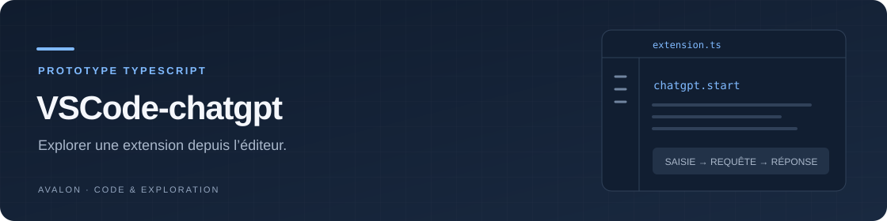

<div align="center">



# VSCode-chatgpt

**Explorer le chemin entre une commande VS Code, une question et une réponse.**

Un prototype TypeScript d’extension, avec saisie, notification et copie dans
le presse-papiers. Son client API historique reste à reprendre.

[](src/extension.ts)
[](package.json)
[](#état-du-prototype)

[Fonctionnement](#ce-qui-est-implémenté) · [État du projet](#état-du-prototype) · [Explorer](#explorer-en-local) · [Configuration](#configuration-et-données)

</div>

Les exemples d’utilisation ci-dessous s’adressent aux personnes disposant des
autorisations nécessaires. [Droits et conditions de réutilisation](RIGHTS.md).

> [!NOTE]
> Ce dépôt présente un prototype. L’interface est implémentée ; le client API
> doit être corrigé avant de pouvoir recevoir une réponse du service.

## Ce qui est implémenté

| Étape | Comportement de l'extension |
|---|---|
| **Ouvrir** | commande `Chat with GPT-3` dans la palette VS Code (`chatgpt.start`) |
| **Questionner** | champ de saisie, avec un message si la question est vide |
| **Appeler** | fonction TypeScript `chatWithGPT` qui construit une requête HTTPS |
| **Lire** | affichage du texte reçu dans une notification VS Code |
| **Copier** | action `Copy Response` qui place la réponse dans le presse-papiers |

L'extension n'ajoute pas automatiquement le contenu des fichiers de code aux
questions et ne maintient pas d'historique de conversation. Le flux prévu
transmet la question saisie au service externe.

## État du prototype

L'interface et le client HTTP sont présents, mais **l'intégration API doit
être reprise avant une utilisation réelle**. Le code de
[`src/chatgpt.ts`](src/chatgpt.ts) référence des identifiants historiques
(`davinci-codex` et `text-davinci-002`), place la clé dans le corps JSON et ne
construit pas d'en-tête d'authentification `Authorization`.

Il ne vérifie pas non plus le statut HTTP avant de décoder la réponse et ne
prévoit pas de gestion complète des erreurs réseau ou de décodage dans la
commande. Le README décrit donc le prototype livré, sans annoncer un service
de conversation opérationnel.

## Explorer en local

Il faut Node.js, npm et VS Code. Le manifeste déclare VS Code `^1.60.0` ; aucune
matrice de compatibilité testée n'est fournie dans le dépôt.

```bash
git clone https://github.com/AdrienAvalon/VSCode-chatgpt.git
cd VSCode-chatgpt
npm ci
npm run compile
code .
```

Dans VS Code, sélectionnez **Run Extension** dans le panneau d'exécution et
lancez le débogage avec `F5`. La configuration du dépôt démarre la compilation
en surveillance, puis ouvre une fenêtre **Extension Development Host**.
La commande **Chat with GPT-3** permet d'explorer le flux de saisie ; recevoir
une réponse nécessite d'abord de corriger le client API.

`npm run watch` relance la compilation lors des changements. Le résultat
TypeScript est écrit dans `out/` ; cette compilation ne valide pas la
connexion au service.

## Configuration et données

Le client lit `OPENAI_API_KEY` avec `dotenv`. Aucune option de configuration
VS Code ni intégration avec le stockage de secrets de l'éditeur n'est déclarée.
Le dépôt contient un fichier `.env` suivi par Git : **n'y placez pas de clé
réelle**. Pour reprendre le projet, prévoyez un stockage local exclu du suivi
ou le stockage de secrets de VS Code avant tout appel authentifié.

La commande envoie le texte saisi au domaine `api.openai.com`. Elle ne propose
pas de mode local et ne prend pas en charge les réglages d'un compte ChatGPT.

## Dans le dépôt

| Fichier | Rôle |
|---|---|
| [`src/extension.ts`](src/extension.ts) | activation, saisie, notifications et presse-papiers |
| [`src/chatgpt.ts`](src/chatgpt.ts) | construction de la requête HTTPS et lecture du texte retourné |
| [`package.json`](package.json) | commande exposée, dépendances et compilation |
| [`tsconfig.json`](tsconfig.json) | compilation TypeScript vers `out/` |
| [`.vscode/launch.json`](.vscode/launch.json) | lancement dans un hôte de développement VS Code |

Le dépôt ne fournit pas de tests automatisés. L'entrée `Extension Tests` du
débogueur référence un chemin de tests qui n'est pas présent dans les sources.
Le [changelog](CHANGELOG.md) conserve la mention de version initiale.

## Contribuer et réutiliser

Les [issues](https://github.com/AdrienAvalon/VSCode-chatgpt/issues) et les pull
requests peuvent servir à reprendre le client API, la configuration et la
gestion des erreurs. Le manifeste attribue le projet à **Adrien CROS**.
Les contributions originales non déjà licenciées restent à [droits réservés](RIGHTS.md).
Réutilisation et exploitation commerciale nécessitent un accord écrit préalable ;
la rémunération commerciale est convenue dans cet accord.
